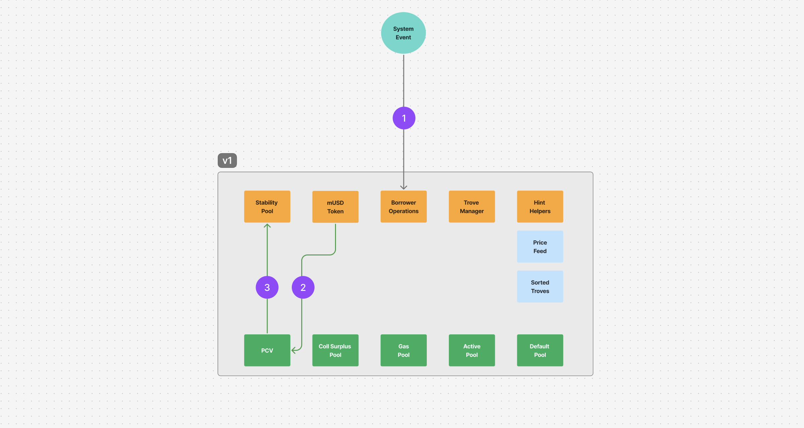
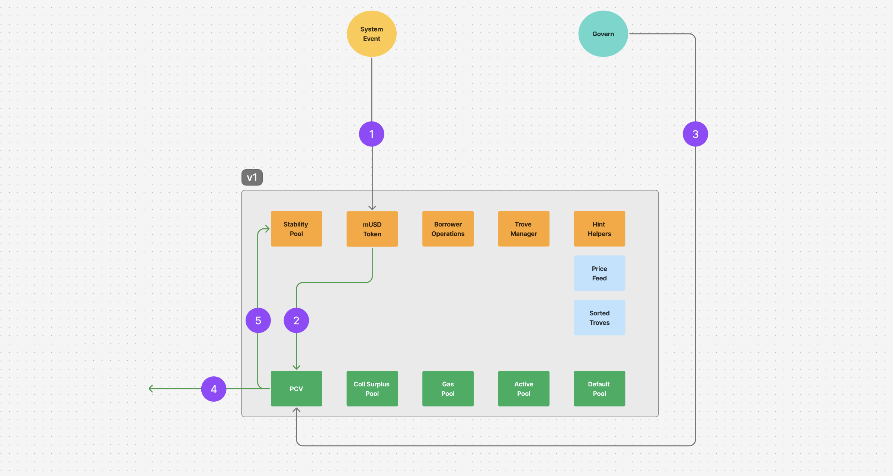
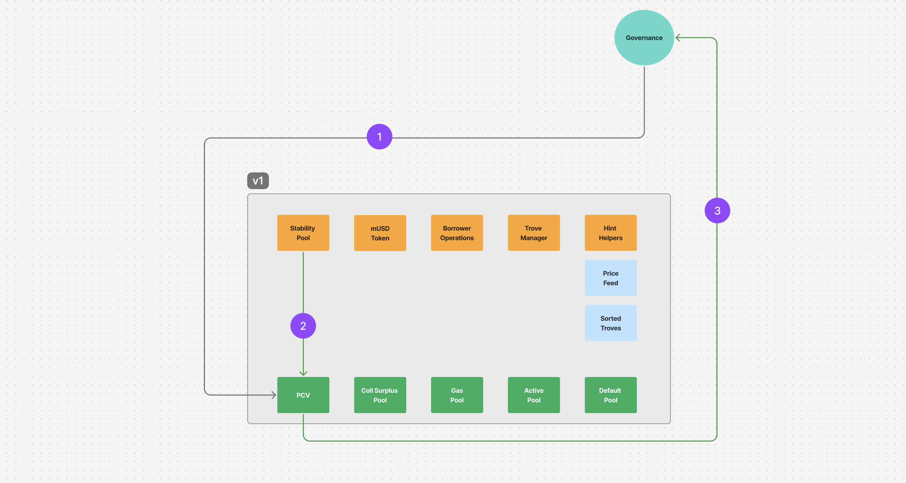
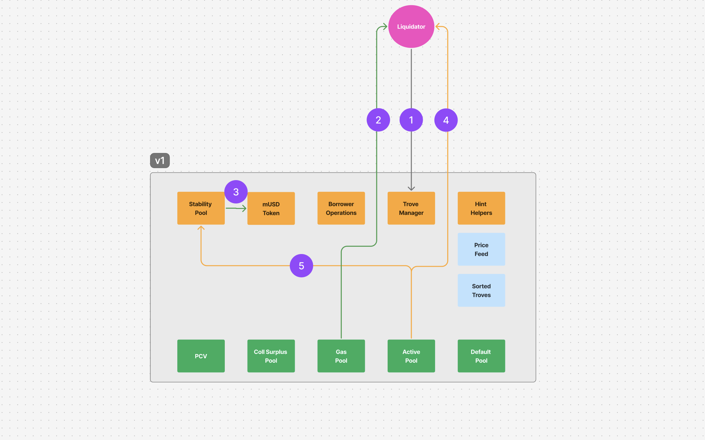
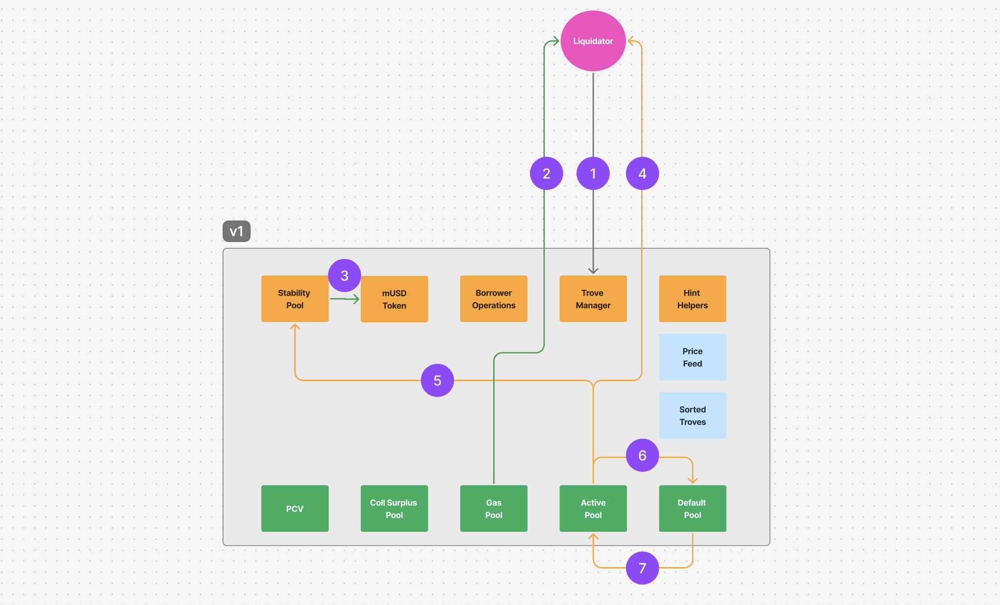
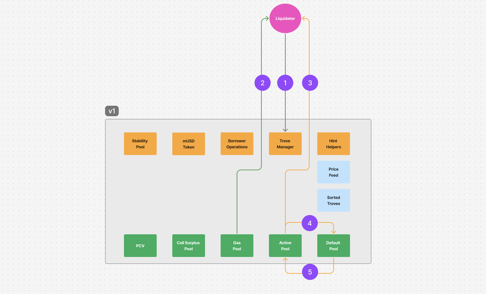
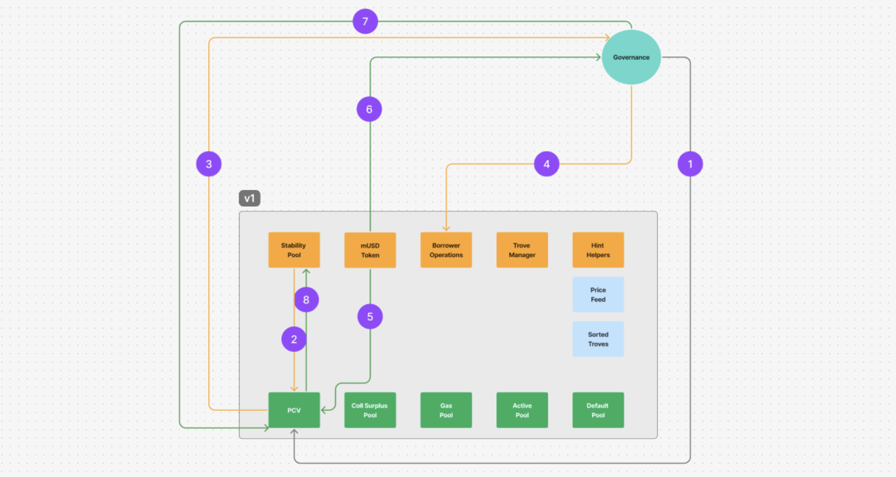
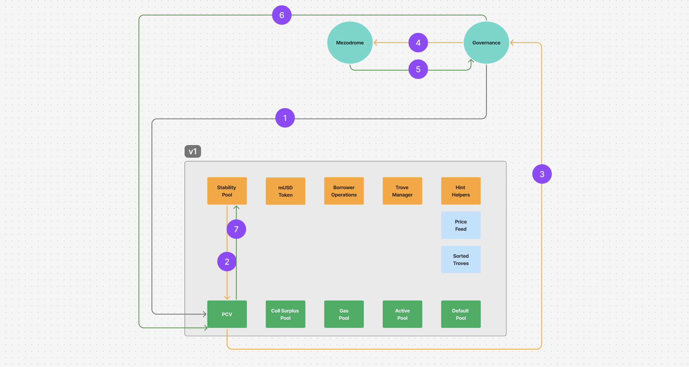
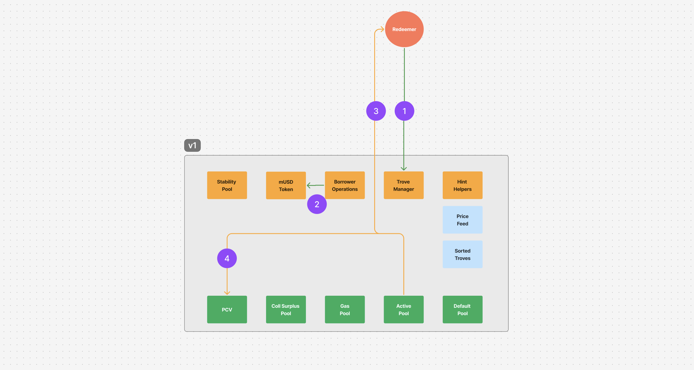
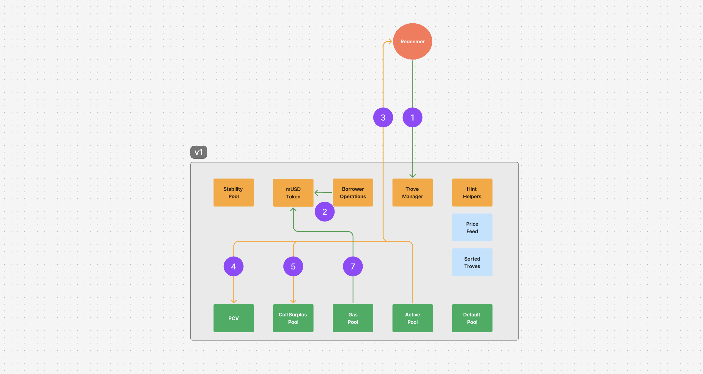

# Mezo USD

MUSD is a stablecoin that is minted by creating a loan against the borrower's crytpo assets, this is known as a Collateralized Debt Position (CDP).

MUSD is based on [Threshold USD](https://github.com/Threshold-USD/dev) which is a fork of [Liquity](https://github.com/liquity/dev) for the [Mezo Network](https://mezo.org).

## Architectural Overview

The protocol allows Bitcoin holders to mint MUSD (mezo USD stablecoins) by using their BTC as collateral. This means users can access USD-denominated liquidity while keeping their Bitcoin investment intact.

The primary components are how the...

- BTC is **custodied**.
- MUSD token maintains its **1 MUSD = $1 price peg**.
- system earns **fees**.

### Custody

A user opens up a position by calling `BorrowerOperations.openTrove`, providing BTC, and requesting MUSD. The BTC is routed to the `ActivePool`, where it stays until a user either...

- withdraws (via `BorrowerOperations.withdrawColl`).
- pays off their debt (via `BorrowerOperations.closeTrove`).
- is redeemed against (via `TroveManager.redeemCollateral`).
- gets liquidated (via `TroveManager.liquidate`).

Liquidated positions are either paid for by the `StabilityPool`, in which case the BTC is transferred there, or the debt and collateral are absorbed and redistributed to other users, in which case the BTC is transferred to the `DefaultPool`.

### Maintaining the Peg

We maintain the **price floor of $1** through arbitrage, an external USD <-> BTC price oracle, and the ability to redeem MUSD for BTC $1 for $1 (via `TroveManager.redeemCollateral`). Imagine that MUSD was trading for $0.80 on an exchange and that bitcoin is selling for 1 BTC = $100k. A arbitrageur with $800 could:

1. Trade $800 for 1000 MUSD.
1. Redeem 1000 MUSD for 0.01 BTC ($1000 worth of BTC).
1. Sell 0.01 BTC for $1000.

The arbitrageur started with $800 and ended with $1000 (ignoring fees). This trade _buys_ MUSD and _burns_ it (for the backing BTC), causing upwards price pressure. This trade continues to be effective until the price resets to $1.

We maintain a **price ceiling of $1.10** via the minimum 110% collateralization ratio. Imagine that MUSD is trading for $1.20 on an exchange, and that bitcoin is selling for 1 BTC = $100k. An arbitrageur with $100k could:

1. Buy 1 BTC (worth $100k).
1. Open up a trove with 1 BTC as collateral, and the maximum 90,909 MUSD as debt.
1. Sell 90,909 MUSD for $109,091.

The arbitrageur started with $100k and ended with $109k (ignoring fees). This trade _sells_ and _mints_ MUSD, causing downward price pressure. This trade continues to be effective until the price reaches $1.10.

### Fees

The protocol collects fees in four places:

- A borrowing rate of 0.1% (governable), which is added as debt to a trove but minted to governance.
- A redemption rate of 0.75% (governable), which is taken whenever a user redeems MUSD for BTC. For example, at 0.5%, whenever $100 of MUSD is redeemed, the user receives $99.50 worth of BTC and the protocol receives $0.50 worth of BTC.
- A refinancing rate, which operates like the borrowing rate.
- [Simple](https://www.investopedia.com/terms/s/simple_interest.asp), [fixed](https://www.creditkarma.com/credit/i/fixed-interest-rate) interest on the principal of the loan.

There is a global, governable interest rate that all new troves use when they are opened but after that, changes to the global interest rate do not impact any existing troves. At any time, a user is allowed to refinance to the global rate.

Simple interest is non-compounding. For example, if a user owes a principal of $10,000 at a 3% annual interest rate, then after a year, they will owe $300 in interest, and after another year (without paying), $600 in interest, and so on.

## Core Ideas

### Part of Ecosystem

The MUSD CDP is a part of the Mezo ecosystem. The interest and fees from MUSD flow into other parts of Mezo.

### Protocol Bootstrap Loan

In Liquity v1 deposits to the Stability Pool earn the LQTY token, this resulted in lots of mint and deposits to the Stability Pool. In MUSD there are no direct incentives for depositing into the Stability Pool, it is not anticipated that borrowers will deposit into the Stability Pool.

The Stability Pool is initally populated with a bootstrapping loan. This can only leave the Stability Pool via liquidations.



Flow of Funds

1. The deployment process makes a call to mint the bootstrap loan to the PCV contract.
2. MUSD is minted to the PCV contract.
3. MUSD is then deposited from the PCV contract into the Stability Pool.

When the protocol's MUSD is withdrawn from the Stability Pool to the PCV contract it is first used to repay any outstanding protocol loan balance. This is to ensure that the bootstrap loan can not be withdrawn from the protocol.

It is anticipated that repayments on the protocol bootstrap loan will be made on a roughly weekly basis via calls to distributeMUSD in the PCV contract.

### Protocol Controlled Value

Protocol Owned Liquidty as the name suggests is owned by the protocol, it is intended to provide utility to the protocol regardless of market conditions and without requiring incentives for the liquidity to stay in place.

Over time as the protocol accrues interest and fees the bootstrap loan gets repaid and the portion of the MUSD in the Stability Pool that is Protocol Owned Liquidity increases.

#### Distributing fees with an active Protocol Loan

When the protocol is initialized with the fee recipient and an active protocol loan the following occurs:


Flow of Funds

1. A user transaction triggers an event that results in a fee or interest collection event.
2. MUSD is minted and sent to the PCV contract.
3. A governance action triggers the movement of MUSD from the PCV contract to the PCV fee recipient address.
4. A portion of the accrued MUSD is sent to the fee recipient.
5. A portion of the MUSD is burnt to reduce the protocol loan.

#### Distributing fees when the Protocol Loan has been repaid

When the protocol is initialized with a fee recipient and the protocol loan has been repaid then the following occurs:



Flow of Funds

1. A user transaction triggers an event that results in a fee or interest collection event.
2. MUSD is minted and sent to the PCV contract.
3. A governance action triggers the movement of MUSD from the PCV contract to the PCV fee recipient address.
4. A portion of the accrued MUSD is sent to the fee recipient.
5. A portion of the MUSD is deposited into the Stability Pool.

#### Distribution of MUSD

The PCV contract has the ability to distribute the MUSD that it accrues from interest and fees. The fee split for how to use that MUSD can be set by governance.

To illustrate how the MUSD is distributed, assume the feeSplitPercentage is set to 60%

- Protocol Loan
  - feeRecipient is not set.
    - 100% of the amount pays down the loan.
  - feeRecipient is set.
    - Loan repayment <= outstanding loan.
      - 60% is used as a repayment of the Protocol loan.
      - 40% is sent to the feeRecipient.
    - Loan repayment > outstanding loan.
      - Protocol loan is repaid.
      - 40% is sent to the feeRecipient.
      - Excess loan repayment amount is deposited into the Stability Pool.
- Protocol Loan has been repaid
  - feeRecipient is not set.
    - 100% of the amount is deposited into the Stability Pool.
  - feeRecipient is set.
    - 60% is deposited into the Stability Pool.
    - 40% is sent to the feeRecipient.

Note that the call to distribute MUSD does not require the entire balance of MUSD held by the PCV contract to be distributed. This means that the distributions to the feeRecipient from the PCV contract can be smoothed out.

The feeRecipient address in the PCV contract can be changed via governance.

#### Withdrawing MUSD

Withdrawing MUSD from the PCV contract is different to distributing MUSD. The call to withdraw MUSD can only be called after the protocol loan has been repaid. This withdraws MUSD to the contract owner, council or treasury address rather than the fee recipient address.



Flow of Funds

1. Governance requests withdrawing MUSD from the Stability Pool.
2. MUSD is transferred from the Stability Pool to PCV.
3. Governance withdraws MUSD.

### Immutability and Upgradability

Unlike Liquity v1 the MUSD smart contracts are upgradable. This provides the flexibility to fix any small issues that arise after launch.

Substantial changes to the functionality would be done by deploying a new set of contracts and adding the new contracts to the MUSD token contracts mintlist and burnlist. This ensures that for any substantial changes the user must take an action to opt in and migrate funds between versions.

When the protocol has been battle tested in production the contracts will be hardened with the upgradability removed. This will give borrowers certainty.

### Liquidations

Whenever a trove becomes under-collateralized (sub 110% BTC value to debt), it is eligible for liquidation. We have two ways to liquidate troves: with the Stability pool (default), and with redistribution (fallback).

When a user (or bot) calls `TroveManager.liquidate` on a trove with sub-110% collateralization ratio, that user is rewarded with a $200 MUSD gas compensation as well as 0.5% of the trove's collateral. Then, the Stability pool burns MUSD to cover all of the trove's debt and seizes the remaining 99.5% of the trove's collateral. It is important to note that anyone is able to execute the call to trigger the liquidation and that they do not require a MUSD balance to take the liquidation, the liquidator only spends BTC on gas for the transaction.

Liquidations can be triggered on individual loans with `TroveManager.liquidate` or on a list of loans with `TroveManager.batchLiquidateTroves`.

#### Liquidation using the Stability Pool

When the Stability Pool has sufficent funds to cover the liquidated loan/s debt, the Stability Pool burns MUSD to cover all of the trove's debt and seizes the remaining 99.5% of the trove's collateral. The MUSD burnt to cover the debt is done proportionately across all MUSD deposits in the Stability Pool, in exchange the Stability Pool depositor has a right to claim the same proportion of the collateral from the liquidation.



Flow of Funds

1. Liquidator sends liquidation request to Trove Manager.
2. Liquidator receives gas compensation (MUSD).
3. Stability Pool burns the MUSD required to buy the debt.
4. Liquidator receives 0.5% of the liquidated BTC.
5. Remaining BTC collateral is sent from the Active Pool to the Stability Pool.

Anyone can deposit into the Stability Pool and proportionately acquire discounted BTC when a liquidation occurs, however it is not expected that users will deposit into the Stability Pool. Unlike Liquity v1 there are no direct incentives for depositing into the Stability Pool. This means the yield from being a Stability Pool depositor would be purely based on the liquidations that occur.

The liquidity source for the Stability Pool is intended to initially be from the [protocol loan](#protocol-bootstrap-loan) and for this balance to grow over time through interest and fees.

#### Liquidation greater than the Stability Pool balance

If there are insufficient funds in the Stability Pool to cover the liquidated loan/s debt, the Stability Pool covers as much debt as it can, burning MUSD in exchange for the collateral. The remaining debt and collateral is proportionately redistributed across the remaining loans.

Impact on Active Borrowers: When debt and collateral are redistributed, each active borrower receives both additional debt and additional collateral proportional to their
existing collateral. Since liquidations occur at 110% collateralization, borrowers receive $1.10 worth of BTC for every $1 of debt added. While this doesn't cause immediate
financial harm, it does:
- Lower their collateralization ratio
- Increase their total debt obligation for future repayment
- Require them to hold more MUSD to eventually close their position



Flow of Funds

1. Liquidator sends liquidation request to Trove Manager.
2. Liquidator receives gas compensation (MUSD).
3. Stability Pool burns the MUSD required to buy the debt.
4. Liquidator receives 0.5% of the liquidated BTC.
5. BTC is sent from the Active Pool to the Stability Pool.
6. BTC for debt that can't be covered by the Stability Pool is sent to the Default Pool.
7. When active loans next have a borrower operation, redemption or liquidation they take on a proportionate amount of the liquidated debt and collateral which results in their share of the liquidated BTC being moved back to the Active Pool.

#### Liquidation when the Stability Pool is empty.

If the Stability Pool is empty, we redistribute both the debt and collateral. All of the debt and collateral is sent to the Default Pool, where a user's ownership of the default pool is equal to their proportional ownership of all deposited collateral. The newly acquired collateral and debt are included for all purposes: calculating collateralization ratio, redemptions, closing a trove, etc.



Flow of Funds

1. Liquidator sends liquidation request to Trove Manager.
2. Liquidator receives gas compensation (MUSD).
3. Liquidator receives 0.5% of the liquidated BTC.
4. BTC is sent from the ActivePool to the DefaultPool for proportionate redistribution to other loans.
5. When active loans next have a borrower operation, redemption or liquidation they take on a proportionate amount of the liquidated debt and collateral which results in their share of the liquidated BTC being moved back to the Active Pool.

The pending debt does not accrue interest until it has been applied to a borrower's loan.  This happens automatically and seamlessly - any interaction with their trove triggers the redistribution to be applied to their actual balances.

Note that when a redistribution of debt and collateral from a liquidated loan is done across the other loans, no external liquidity source is required.

#### Liquidations and Protocol Owned Liquidity

The Stability Pool is initially seeded with a [bootstrap loan](#protocol-bootstrap-loan) against the protocol's future fees, over time the MUSD minted as part of this loan is converted into Protocol Owned Liquidity through fees and interest being burnt by the PCV contract.

BTC acquired by the protocol through liquidations may be converted back into MUSD and redeposited into the Stability Pool depending on the maturity and state of the protocol at the time of liquidation.

##### Rebalancing Large Liquidations

In the early days of Liquity v1 the protocol almost had to deal with a stress test from a large deposit that was a disproportionate amount of the TVL getting liquiditated. This could have resulted in cascading liquidations with sustained negative price action.

The protocol loan is intended to help mitigate this circumstance.

If this scenario was to arise early into the life of MUSD where a $100M liquidation emptied the Stability Pool, this might leave $109M of BTC in the Stability Pool and insufficient BTC in the Active Pool to honour redemptions for all of the circulating MUSD. In this event the governance process that manages the PCV contract would withdraw the BTC from the Stability Pool and open a loan to borrow MUSD against BTC to get the BTC back into the Active Pool so that redemptions are able to honour requests. The borrowed MUSD would then be deposited into the Stability Pool.



Flow of Funds

1. Governance requests withdrawing BTC from Stability Pool.
2. BTC is transferred from Stability Pool to PCV.
3. Governance withdraws BTC.
4. Governance deposits BTC into Borrower Operations to open a loan.
5. MUSD Borrow fee is sent to PCV.
6. MUSD is sent to governance.
7. Governance deposits MUSD back into PCV.
8. PCV transfers MUSD back to Stability Pool.

This would result in a decrease in the total MUSD in the Stability Pool as the collateralisation requirements to open at a safe collateralisation level. However it is important to note that the Stability Pool balance would be replenished over time through interest and fees.

##### Rebalancing Small Liquidations

For smaller liquidations the governance process that manages the PCV contract would withdraw BTC from the Stability Pool and swap to MUSD then redeposit into the Stability Pool.

When the protocol's Stability Pool deposit is used to offset liquidations, that results in BTC from the liquidated loans to be in the Stability Pool. The governance process is able to withdraw the BTC to exchange it into MUSD to redeposit into the Stability Pool.



Flow of Funds

1. Governance requests withdrawing BTC from Stability Pool.
2. BTC is transferred from Stability Pool to PCV.
3. Governance withdraws BTC.
4. Governance swaps BTC.
5. Governance recieves MUSD.
6. Governance deposits MUSD back into PCV.
7. PCV transfers MUSD back to Stability Pool.

Initially this process would be manually executed via a governance multisig and eventually automated with a smart contract once routing liqudity on Mezo has matured. This is to ensure the Protocol Owned Liquidity does not get raided by MEV while the infrastructure for the new chain matures.

#### Liquidations and the last loan

The system requires at least one active loan, if there is only one loan in the system it can not be liquidated. Liquidations require there to be other troves to distribute the debt and collateral to if the Stability Pool is empty.

### Stability Pool

The Stability Pool provides a mechanism to socialize liquidations. Users deposit MUSD into the pool, and the stability pool has first priority to provide MUSD to liquidate troves and seize collateral.

In effect, the Stability Pool is buying BTC at a discount from liquidated troves. If a trove has $10000 in debt backed by $11000 worth of BTC, then when that trove is liquidated, the pool loses $10000 MUSD and gains $10,945 worth of BTC. In effect, they were able to buy $10945 worth of BTC for $10000 which is a ~9% discount.

Users own shares of the pool, and when they exit the pool, they withdraw both their MUSD and their share of seized BTC.

For example, say that the pool currently has $20000 MUSD. A user deposits $5000 MUSD. They would own 5000 shares out of 25000 shares. Later, the pool burns $3000 MUSD and seizes $3270 worth of BTC and the user decides to exit. The pool still has 25000 shares, but now has $22000 MUSD and $3270 BTC. The user withdraws `5000 / 25000 * $22000 = $4400` MUSD and `5000 / 25000 * $3270 = $654` worth of BTC.

The Stability pool is seeded by a bootstrap loan given to governance. $100m MUSD is minted against future fees, and the `PCV` contract assumes $100m of debt. That $100m MUSD is deposited directly into the Stability Pool. 50% of all [protocol fees](#fees) are burned to incrementally pay off this bootstrap loan.

### Redemptions

A user may call `TroveManager.redeemCollateral` to burn MUSD to obtain BTC, $1 for $1 worth (minus the redemption fee). This is the main mechanism [maintaining the peg](#maintaining-the-peg).

The trove with the lowest collateral ratio (but above the 110% liquidation threshold) has an equivalent amount of debt canceled, and then their BTC is trasferred to the redeeming user. This has a net effect of _raising_ their collateral ratio.

For example, say that...

- Alice has $1000 debt backed by $1300 collateral (130% ratio).
- Bob has $1000 debt backed by $2000 collatearl (200% ratio).

Carol redeems $50. Alice's debt and collateral are reduced by $50. Carol receives `$50 * .995 = $49.75` worth of BTC, and the protocol receives `$50 * .005 = $0.25` as a redemption fee.

Alice now has $950 debt backed by $1250 collateral (132% ratio).

Someone's full debt can be cancelled in this way. For example, if Carol redeemed $1000 instead of $50, then Alice's debt would be fully paid, and she would be left with $300 worth of collateral. The remaining collateral is sent to the `CollSurplusPool`. Alice can collect it by calling `BorrowerOperations.claimCollateral`.

Note that the redemption amount must leave the loan with a debt level greater than the minNetDebt value, which is set to 1800 MUSD to prevent the sorted loans list from being
filled with nearly empty troves that could cause redemption requests to fail by running out of gas

#### Partial Loan Redemption

When the redemption amount is less than the debt of the loan with the lowest collateralisation this results in a partial redemption.



Flow of Funds

1. Redeemer deposits MUSD into TroveManager contract.
2. MUSD is burnt.
3. BTC is sent to the Redeemer.
4. Redemption fee is sent to PCV.

#### Full Loan Redemption

When the redemption amount is greater than a loans value, that loan become fully redeemed. The remaining redemption amount is then applied to the next loan, this continues until the full redemption amount is fulfilled.



Flow of Funds

1. Redeemer deposits MUSD into BorrowerOperation contract and fully redeems a borrowers debt.
2. MUSD is burnt.
3. BTC is sent to the Redeemer.
4. Redemption fee is sent to PCV.
5. Borrowers excess BTC is sent to the CollSurplusPool.
6. Liquidation reserve is burnt.

#### Prerequisites
- The Total Collateral Ratio (TCR) must be above the Minimum Collateral Ratio (MCR)
- The redeemer must have sufficient MUSD balance
- The redemption amount must be greater than zero

#### Partial Redemptions

Most redemptions include a partial redemption, because the redeemed amount rarely matches a series of Troves' entire debt exactly.

After a partial redemption, the Trove—with its collateral and debt reduced—is re-inserted into the sorted list and remains active.

Caveat: a partial redemption must never leave a Trove with less than the protocol’s minimum debt. If redeeming the final Trove in the sequence would push its debt below that floor, the system redeems only the maximum amount that keeps the Trove at or above the minimum, and any unused MUSD is returned. This permissible amount can be pre-calculated when generating redemption hints, as discussed later.

#### Calculating Redemption Hints

The system calculates hints by:
1. Finding the first trove with ICR >= MCR
2. Simulating the redemption to determine the final state
3. Computing the nominal ICR for partial redemptions
4. Finding the correct position in the sorted troves list

See the code below for an example:
```typescript
// Get redemption hints
const {
    firstRedemptionHint,        // First trove to redeem from
    partialRedemptionHintNICR,  // Nominal ICR of the last trove after partial redemption
    truncatedAmount            // Maximum amount that can be redeemed
} = await hintHelpers.getRedemptionHints(
    redemptionAmount,
    currentPrice,
    maxIterations
);

// Get insert position hints
const { 
    upperPartialRedemptionHint,
    lowerPartialRedemptionHint 
} = await sortedTroves.findInsertPosition(
    partialRedemptionHintNICR,
    redeemerAddress,
    redeemerAddress
);

// Perform redemption
if (truncatedAmount > 0) {
  await troveManager.redeemCollateral(
    truncatedAmount,
    firstRedemptionHint,
    upperPartialRedemptionHint,
    lowerPartialRedemptionHint,
    partialRedemptionHintNICR,
    maxIterations
  );
}
```

#### Common Issues and Solutions

1. **Redemption Reverts**
  - If no collateral can be drawn (all troves below MCR)
  - If partial redemption would leave a trove below minimum debt
  - If hints are outdated (another transaction modified the system)

2. **Partial Redemption Failures**
  - Ensure hints are up to date
  - Consider splitting large redemptions into smaller amounts
  - Use the `truncatedAmount` from `getRedemptionHints` to know the maximum redeemable amount

## Supporting Ideas

### Gas Compensation

When a user opens up a trove, an extra flat $200 MUSD is minted for gas compensation, sent to the `GasPool`, and added to the borrower's debt. This debt is included when calculating the user's collateral ratio.

When a trove is liquidated, the whole debt (including the $200 gas compensation) is paid. The initiator of the liquidation is sent the $200 gas compensation, to offset any gas they might pay to call the liquidation function, especially in times of high network traffic.

In other situations (redemption, closing a trove, repaying debt), the last $200 of debt of a trove is paid by the Gas Pool.

For example, say that Alice wants to mint $2000 MUSD with $3000 of BTC as collateral. Alice will receive $2000, $200 will be sent to the Gas Pool, and a borrowing fee of $10 (0.5%) is sent to the protocol.

Alice's total debt, for liquidations or calculating collateral ratios, is $2210.

If Bob liquidates Alice, The stability pool burns $2210 and the Gas Pool sends Bob $200.

If Bob fully redeems Alice, only $2010 can be redeemed; the Gas Pool burns the remaining $200 to close Alice's trove.

If Alice closes her own trove, she only needs to pay back $2010; the Gas Pool will burn the remaining $200 to pay off all of the debt.

### Recovery Mode

If the Total Collateral Ratio (TCR), the value of all of the collateral divided by the total debt, of the system ever falls below the Critical Collateral Ratio (CCR) of 150%, we enter into Recovery Mode.

In Recovery Mode...

- We require that newly opened troves have at least 150% (the CCR) collateral, rather than the normal 110%.
- We do not charge an borrowing rate.
- We do not allow users to close troves.
- Debt increases must be in combination with collateral increases such that the trove's collateral ratio improves _and_ is above 150%.
- Users cannot refinance their trove.

Each of these changes ensures the system returns back to above 150% TCR quickly.

### Pending Funds

If the Stability Pool has insufficient funds to cover all of the trove debt, we redistribute both the debt and collateral. All of the debt and collateral is sent to the Default Pool, where a user's ownership of the default pool is equal to their proprotional ownership of all deposited collateral.

As a gas optimization, we track the these funds as "pending", so each borrower has pending collateral, pending principal, and pending interest, which are moved out of the default pool and back to the active pool the next time a borrower interacts with their trove.

`TroveManager.sol` maintains `L_Collateral`, `L_Principal`, and `L_Interest`, which tracks the total amount of pending collateral, principal, and interest in the default pool, per unit of collateral in the system. On a user level, we track snapshots of those values, so we can calculate the pending funds of a user when they interact with the system.

For example, if `rewardSnapshots[_borrower].collateral < L_Collateral`, then the user has pending collateral.

## Borrower Risks

There are two primary risks for borrowers

- Liquidation Risk.
- Redemption Risk.
- Bad Debt.
- Depegging.

### Liquidation Risk

If the borrower’s deposit falls below the liquidation threshold of 110% collateralization, the borrower's collateral can be liquidated to close out their loan. This is done to protect the overall collatearlisation of the protocol. This has the following implications for the liquidated borrower:

- Potential capital gains tax implications.
- Up to a 10% capital loss.
- Loss of exposure to the price upside of the collateral asset.

To avoid these risks, borrowers must monitor their loans and provide additional collateral to maintain their loan health.

### Redemption Risk

The protocol enables holders of MUSD to redeem it for BTC, this acts as a mechanism to bring the price back to peg via arbitrage if it depegs downwards. The trade off is that this redemption is done against the collateral of the borrower with the lowest collateralisation ratio. This mechanism cancels $1 of debt for each $1 of BTC that is redeemed. This has the following implications for the liquidated borrower:

- Potential capital gains tax implications.
- Loss of exposure to the price upside of the collateral asset.

For example assume that Bob has a 200k MUSD debt that is backed by 3 BTC and BTC is trading at $100k USD. If Bob's loan has the lowest collateralisation and Alice redeems 200k MUSD, her redemption will be against Bob's BTC. So Bob's debt will be cancelled as his collateral balance is reduced.

If Bob is fully redeemed against this means that he would no longer have a loan to repay.

The redemption cancels the debt of the borrower on a dollar with dollar basis as their BTC gets redeemed.

So Bob had 1 BTC of his collateral redeemed which also cancelled his 200k of debt. Bob still has the MUSD he borrowed and is able to withdraw the remaining 1 BTC of excess collateral. It is important to note that when Bob is redeemed against he loses the upside exposure of the BTC that was redeemed.

### Bad Debt

Bad debt occurs when the value of the collateral is less than the amount that has been borrowed. This debt is handled the same way as other liquidations, this leads to either depositors in the Stability Pool absorbing the loss or the bad debt being proportionately redistributed across the other loans.

It is anticipated that bad debt would be a low probability event due to the following:

- Low cost for liquidators to trigger a liquidation.
- Liquidators receive 200 MUSD + 0.5% of the liquidated collateral.
- Fast block times on Mezo should lead to quick finality when a liquidation becomes available.
- The BTC price oracle updates on a per block basis.
- There is a 10% margin for profitable liquidations.
- Redistribution of debt and collateral from liquidations when the Stability Pool is empty do not require an external liquidity source to complete the liquidation.

## Key Changes from THUSD

Much of MUSD comes from [Threshold USD](https://github.com/Threshold-USD/dev), but there are a few key differences to highlight:

### Fixed-Interest Borrowing

- **Global Interest Rate**: A single global interest rate applies to all newly opened troves.

- **Maintaining Interest Rates**: Once a trove is opened, it retains the interest rate at which it was created, even if the global rate changes. The interest rate on a trove can only be updated by the user through the `refinance` function.

- **Refinance Function**: The `refinance` function allows users to adjust their trove's debt to the new global interest rate. This process incurs a refinancing fee, which is a configurable percentage of the issuance fee. Refinancing offers users the advantage of avoiding collateral movement while incurring lower fees compared to closing and reopening a trove at the updated rate.

- **Simple Interest**: Interest is calculated using a simple interest model rather than a compounding one.

- **Interest Payments**: Interest payments are directed to the PCV (Protocol Controlled Value). The allocation of these payments is governed and can be split between an arbitrary recipient and repayment of the bootstrap loan.

For further information, refer to [simpleInterest.md](simpleInterest.md).

### Additional Governance

- **Governance Control**: The interest rate and other critical parameters are controlled by governance. Changes to these parameters require a governance proposal and a minimum delay before they can be enacted.

- **Interest Rate Proposals**: New interest rates can be proposed by governance. These proposals must be approved after a minimum delay to ensure stability and predictability.

### Protocol Controlled Value (PCV)

The **Protocol Controlled Value (PCV)** contract is a key component of the system, responsible for managing fees collected from borrowing and refinancing. Below is an overview of how the PCV operates:

- **Fee Collection**: Borrowing fees and refinancing fees are directed to the PCV contract.

- **Fee Allocation**: Fees collected by the PCV are allocated to two purposes: paying down the bootstrap loan and sending funds to the gauge system.

- **Governable Split**: The allocation of fees between paying down the debt and the gauge system is governable. However, until the bootstrap loan is fully repaid, no more than **50% of the fees** can be sent to the gauge system.

- **Post-Debt Repayment**: Once the bootstrap loan is fully repaid, **100% of the fees** collected by the PCV are automatically sent to the gauge system.

### EIP-712 Signature Verification

The MUSD system implements EIP-712 signature verification through the `BorrowerOperationsSignatures` contract, allowing users to authorize operations on their troves without directly executing transactions.

- **Smart Contract Integration**: This mechanism enables other smart contracts to execute operations on behalf of users who have provided signed authorizations, facilitating integration with other DeFi protocols.

- **Supported Operations**: All major trove operations are supported, including opening troves, adjusting collateral and debt, refinancing, and closing troves.

- **Security Features**: Includes nonce tracking to prevent replay attacks and deadline parameters to ensure signatures expire after a specified time.

- **Authorization Flow**: The signature verification contract validates the user's signature before calling the corresponding restricted function in the BorrowerOperations contract.

This feature enhances user experience by enabling delegation of transaction execution while maintaining security through cryptographic verification of user intent. It also creates opportunities for third-party applications to build on top of MUSD by allowing them to manage user positions with proper authorization.

### No Special Recovery Mode Liquidations

Unlike THUSD, MUSD does not have special handling for liquidations during recovery mode. All liquidations follow a single process regardless of the system's collateralization ratio.

## System Overview

The MUSD system consists of four main contract groups:

```mermaid
graph TD
    subgraph TokenSystem["Token"]
        MUSD
    end
    subgraph Core["Core Protocol"]
        BorrowerOperations
        TroveManager
        StabilityPool
    end
    subgraph Pools["Asset Pools"]
        ActivePool
        DefaultPool
        CollSurplusPool
        GasPool
    end
    subgraph Support["Supporting Contracts"]
        BorrowerOperationsSignatures
        PriceFeed
        SortedTroves
        HintHelpers
        InterestRateManager
        PCV
    end
    TokenSystem-->Core
    Core-->Pools
    Pools-->Support
    linkStyle 0 stroke-opacity:1
    linkStyle 1 stroke-opacity:1
    linkStyle 2 stroke-opacity:1
```

- **Token (MUSD)**: The stablecoin at the heart of the system, designed to maintain a peg to USD.
- **Core Protocol**: Handles the main operations like opening/closing positions, managing collateral, and maintaining system stability
- **Asset Pools**: Manages the system's various collateral and liquidity pools
- **Supporting Contracts**: Provides essential services like price feeds, remote trove management, position sorting, and protocol-controlled value management

### Core Smart Contracts

`MUSD.sol` - the stablecoin token contract, which implements the ERC20 fungible token standard in conjunction with EIP-2612. The contract mints, burns and transfers mUSD tokens.

`BorrowerOperations.sol` - contains the basic operations by which borrowers interact with their Trove: Trove creation, collateral top-up / withdrawal, stablecoin issuance and repayment. BorrowerOperations functions call in to TroveManager, telling it to update Trove state, where necessary. BorrowerOperations functions also call in to the various Pools, telling them to move collateral/Tokens between Pools or between Pool <> user, where necessary.

`BorrowerOperationsSignatures.sol` - contains `*WithSignature` functions that enable a third party (like a smart contract) to perform actions like adding and removing collateral and musd from a trove, given that the third party supplies a valid signature from the trove owner.

`InterestRateManager.sol` - handles operations for setting interest rates as well as interest related calculations.

`PriceFeed.sol` - provides price data for collateralization calculations.

`TroveManager.sol` - contains functionality for liquidations and redemptions. Also contains the state of each Trove - i.e. a record of the Trove’s collateral and debt. TroveManager does not hold value (i.e. collateral / other tokens). TroveManager functions call in to the various Pools to tell them to move collateral/tokens between Pools, where necessary.

`SortedTroves.sol` - Maintains a sorted list of Troves by Individual Collateral Ratio (ICR).

`StabilityPool.sol` - contains functionality for Stability Pool operations: making deposits, and withdrawing compounded deposits and accumulated collateral gains. Holds the MUSD Stability Pool deposits, and the collateral gains for depositors, from liquidations.

### MUSD Token - `MUSD.sol`

`startRevokeMintList(address _account)`: This function initiates the process of revoking a borrower operations contract's capability to mint new tokens. It first validates that the address provided in `_account` parameter is included in the `mintList`. Once verified, the function initializes the revocation process by updating `revokeMintListInitiated` with the current block timestamp and `pendingRevokedMintAddress` with the address passed in `_account` parameter.

`cancelRevokeMintList()`: It cancels the existing revoking mint process. The function first validates whether the `pendingRevokedMintAddress` is non-zero to confirm the presence of an ongoing pending revoking process. Once verified, it resets both `revokeMintListInitiated` and `pendingRevokedMintAddress` to zero and `address(0)` respectively, effectively finalizing the existing revoking process.

`finalizeRevokeMintList()`: This function revokes the minting capability to the borrower operations contract, previously designated in the `pendingRevokedMintAddress`. It executes only after the governance delay has elapsed following the `revokeMintListInitiated` timestamp. By finalizing the revoke mint process it resets the `pendingRevokedMintAddress` and `revokeMintListInitiated`.

`startAddMintList(address _account)`: This function initiates the process of adding a borrower operations contract's capability to mint new tokens. It first validates that the address provided in `_account` parameter isn't included in the `mintList`. Once verified, the function initializes the adding process by updating `addMintListInitiated` with the current block timestamp and `pendingAddedMintAddress` with the address passed in `_account` parameter.

`cancelAddMintList()`: It cancels the existing adding mint process. The function first validates whether the `addMintListInitiated` is non-zero to confirm the presence of an ongoing pending adding mint capability process. Once verified, it resets both `addMintListInitiated` and `pendingAddedMintAddress` to zero and `address(0)` respectively. Effectively finalizing the existing revoking process.

`finalizeAddMintList()`: This function adds the minting capability to the borrower operations contract, previously designated in the `pendingAddedMintAddress`. It executes only after the governance delay has elapsed following the `addMintListInitiated` timestamp. By finalizing the revoke mint process it resets the `pendingAddedMintAddress` and `addMintListInitiated`.

`startAddContracts(address _troveManagerAddress, address _stabilityPoolAddress, address _borrowerOperationsAddress, address _interestRateManagerAddress)`: This function initiates the process of integrating borrower operations, trove manager, stability pool, and interest rate manager contracts, enabling them to mint and burn MUSD tokens.

`cancelAddContracts()`: This function terminates the current process of adding contracts.

`finalizeAddContracts()`: This function adds the minting and burning capabilities to the borrower operations, trove manager, interest rate manager, and stability pool contracts previously designated in the `pendingBorrowerOperations`, `pendingStabilityPool`, `pendingInterestRateManager`, and `pendingTroveManager`. It executes only after the governance delay has elapsed following the `addContractsInitiated` timestamp.

`startRevokeBurnList(address _account)`: This function initiates the process of revoking a contract's capability to burn MUSD tokens.

`cancelRevokeBurnList()`: Cancels the existing revoking mint process.

`finalizeRevokeBurnList()`: This function revokes the minting capability from a contract, previously designated in the `pendingRevokedBurnAddress`. It executes only after the governance delay has elapsed following the `revokeBurnListInitiated` timestamp. By finalizing the revoke mint process it resets the `pendingRevokedBurnAddress` and `revokeBurnListInitiated`.

### Borrower Operations - `BorrowerOperations.sol`

`openTrove(uint _debtAmount, address _upperHint, address _lowerHint)`: payable function that creates a Trove for the caller with the requested debt, and the collateral received. Successful execution is conditional mainly on the resulting collateralization ratio which must exceed the minimum (110% in Normal Mode, 150% in Recovery Mode). In addition to the requested debt, extra debt is issued to pay the issuance fee, and cover the gas compensation.

`addColl(address _upperHint, address _lowerHint))`: payable function that adds the received collateral to the caller's active Trove.

`withdrawColl(uint _amount, address _upperHint, address _lowerHint)`: withdraws `_amount` of collateral from the caller’s Trove. Executes only if the user has an active Trove, the withdrawal would not pull the user’s Trove below the minimum collateralization ratio, and the resulting total collateralization ratio of the system is above 150%.

`withdrawMUSD(uint _amount, address _upperHint, address _lowerHint)`: issues `_amount` of MUSD from the caller’s Trove to the caller. Executes only if the Trove's collateralization ratio would remain above the minimum, and the resulting total collateralization ratio is above 150%.

`repayMUSD(uint _amount, address _upperHint, address _lowerHint)`: repay `_amount` of MUSD to the caller’s Trove, subject to leaving enough debt in the Trove for gas compensation.

`adjustTrove(address _borrower, uint _collWithdrawal, uint _debtChange, bool _isDebtIncrease, address _upperHint, address _lowerHint)`: enables a borrower to simultaneously change both their collateral and debt, subject to all the restrictions that apply to individual increases/decreases of each quantity with the following particularity: if the adjustment reduces the collateralization ratio of the Trove, the function only executes if the resulting total collateralization ratio is above 150%.

`closeTrove()`: allows a borrower to repay all debt, withdraw all their collateral, and close their Trove. Requires the borrower have an MUSD balance sufficient to repay their Trove's debt, excluding gas compensation - i.e. `(debt - MUSD_GAS_COMPENSATION)` MUSD.

`claimCollateral(address _user)`: when a borrower’s Trove has been fully redeemed from and closed, or liquidated in Recovery Mode with a collateralization ratio above 110%, this function allows the borrower to claim their collateral surplus that remains in the system (collateral - debt upon redemption; collateral - 110% of the debt upon liquidation).

`refinance()`: allows a borrower to move their debt to a new (presumably lower) interest rate. In addition to the original debt, extra debt is issued to pay the refinancing fee.

### BorrowerOperationsSignatures Functions - `BorrowerOpeationsSignatures.sol`

Each function requires a signature and deadline (when the signature is valid until). For examples of how to craft these signatures and deadlines, check out any of the `WithSignature` tests in `BorrowerOperations.test.ts`.

`addCollWithSignature(address _upperHint, address _lowerHint, address _borrower, bytes memory _signature, uint256 _deadline)`: payable function that adds the received collateral to the signer's active Trove.

`closeTroveWithSignature(address _borrower, bytes memory _signature, uint256 _deadline)`: allows a signer to repay all debt, withdraw all their collateral, and close their Trove. Requires the caller have an MUSD balance sufficient to repay the signer's Trove's debt, excluding gas compensation - i.e. `(debt - MUSD_GAS_COMPENSATION)` MUSD.

`adjustTroveWithSignature(uint256 _collWithdrawal, uint256 _debtChange, bool _isDebtIncrease,address _upperHint, address _lowerHint, address _borrower, bytes memory _signature, uint256 _deadline)`: enables a caller to simultaneously change a signer's collateral and debt, subject to all the restrictions that apply to individual increases/decreases of each quantity with the following particularity: if the adjustment reduces the collateralization ratio of the Trove, the function only executes if the resulting total collateralization ratio is above 150%.

`withdrawCollWithSignature(uint256 _amount, address _upperHint, address _lowerHint, address _borrower, bytes memory _signature, uint256 _deadline)`: withdraws `_amount` of collateral from the signer's Trove. Executes only if the signer has an active Trove, the withdrawal would not pull the signer's Trove below the minimum collateralization ratio, and the resulting total collateralization ratio of the system is above 150%.

`openTroveWithSignature(uint256 _debtAmount, address _upperHint, address _lowerHint, address _borrower, bytes memory _signature, uint256 _deadline)`: payable function that creates a Trove for the signer with the requested debt, and the collateral received from the caller. Successful execution is conditional mainly on the resulting collateralization ratio which must exceed the minimum (110% in Normal Mode, 150% in Recovery Mode). In addition to the requested debt, extra debt is issued to pay the issuance fee, and cover the gas compensation.

`withdrawMUSDWithSignature(uint256 _amount, address _upperHint, address _lowerHint, address _borrower, bytes memory _signature, uint256 _deadline)`: issues `_amount` of MUSD from the signer’s Trove to the signer. Executes only if the Trove's collateralization ratio would remain above the minimum, and the resulting total collateralization ratio is above 150%.

`repayMUSDWithSignature(uint256 _amount, address _upperHint, address _lowerHint, address _borrower, bytes memory _signature, uint256 _deadline)`: repay `_amount` of MUSD to the signer’s Trove from the caller, subject to leaving enough debt in the Trove for gas compensation.

`refinanceWithSignature(address _borrower, bytes memory _signature, uint256 _deadline)`: allows a caller to move the signer's debt to a new (presumably lower) interest rate. In addition to the original debt, extra debt is issued to pay the refinancing fee.

`claimCollateralWithSignature(address _borrower, bytes memory _signature, uint256 _deadline)`: when a signer’s Trove has been fully redeemed from and closed, or liquidated in Recovery Mode with a collateralization ratio above 110%, this function allows the caller to forward the signer's collateral surplus that remains in the system (collateral - debt upon redemption; collateral - 110% of the debt upon liquidation).

### TroveManager Functions - `TroveManager.sol`

`liquidate(address _borrower)`: callable by anyone, attempts to liquidate the Trove of `_user`. Executes successfully if `_user`’s Trove meets the conditions for liquidation (i.e. the Trove's ICR < the system MCR).

`batchLiquidateTroves(address[] calldata _troveArray)`: callable by anyone, accepts a custom list of Troves addresses as an argument. Steps through the provided list and attempts to liquidate every Trove, until it reaches the end or it runs out of gas. A Trove is liquidated only if it meets the conditions for liquidation. For a batch of 10 Troves, the gas costs per liquidated Trove are roughly between 75K-83K, for a batch of 50 Troves between 54K-69K.

`redeemCollateral(uint _MUSDAmount, address _firstRedemptionHint, address _upperPartialRedemptionHint, address _lowerPartialRedemptionHint, uint _partialRedemptionHintNICR, uint _maxIterations)`: redeems `_MUSDamount` of stablecoins for ether from the system. Decreases the caller’s MUSD balance, and sends them the corresponding amount of collateral. Executes successfully if the caller has sufficient MUSD to redeem. The number of Troves redeemed from is capped by `_maxIterations`.

`getCurrentICR(address _user, uint _price)`: computes the user’s individual collateralization ratio (ICR) based on their total collateral and total MUSD debt. Returns 2^256 -1 if they have 0 debt.

`getTroveOwnersCount()`: get the number of active Troves in the system.

`getPendingCollateral(address _borrower)`: get the pending collateral from liquidation redistribution events, for the given Trove.

`getPendingDebt(address _borrower)`: get the pending Trove debt (i.e. the amount of extra debt assigned to the Trove) from liquidation redistribution events.

`getEntireDebtAndColl(address _borrower)`: returns a Trove’s entire debt and collateral, which respectively include any pending debt rewards and collateral rewards from prior redistributions.

`getEntireSystemColl()`: Returns the systemic entire collateral allocated to Troves, i.e. the sum of the collateral in the Active Pool and the Default Pool.

`getEntireSystemDebt()` Returns the systemic entire debt assigned to Troves, i.e. the sum of the MUSDDebt in the Active Pool and the Default Pool.

`getTCR()`: returns the total collateralization ratio (TCR) of the system. The TCR is based on the entire system debt and collateral (including pending rewards).

`checkRecoveryMode()`: reveals whether the system is in Recovery Mode (i.e. whether the Total Collateralization Ratio (TCR) is below the Critical Collateralization Ratio (CCR)).

## Opening a Trove from a Front End

We keep a list of all open troves sorted by collateralization ratio on chain, implemented as a linked list. Since finding the proper insertion point for a new trove (or an adjusted trove) would be computationally expensive naively, the relevant functions (like `BorrowerOperations.openTrove`) take a `_upperHint` and `_lowerHint`, to narrow the search.

We use `SortedTroves.findInsertPosition` to find these hints, which in turn needs _approximate_ hints, from `HintHelpers.getApproxHint`. This is involved, so we provide an example (in typescript):

```ts
// Amount of MUSD to borrow
const debtAmount = to1e18(2000)

// Amount of collateral (in BTC)
const assetAmount = to1e18(10)

// Compute hints using HintHelpers and SortedTroves

// Compute expected total debt by adding gas compensation and fee
const gasCompensation = await troveManager.MUSD_GAS_COMPENSATION()
const expectedFee = await troveManager.getBorrowingFeeWithDecay(debtAmount)
const expectedTotalDebt = debtAmount + expectedFee + gasCompensation

// Nominal CR is collateral * 1e20 / totalDebt
// Note that price is not included in this calculation
const nicr = (assetAmount * to1e18(100)) / expectedTotalDebt

// Get an approximate address hint from HintHelpers contract
const numTroves = Number(await sortedTroves.getSize())

// Use 15•sqrt(troves)
const numTrials = BigInt(Math.ceil(Math.sqrt(numTroves))) * 15n

// A source of noise, does not need to be cryptographically secure.
const randomSeed = Math.ceil(Math.random() * 100000)

const { 0: approxHint } = await hintHelpers.getApproxHint(
  nicr,
  numTrials,
  randomSeed,
)

// Use the approximate hint to get exact upper and lower hints
const { 0: upperHint, 1: lowerHint } = await sortedTroves.findInsertPosition(
  nicr,
  approxHint,
  approxHint,
)

await borrowerOperations
  .connect(carol.wallet)
  .openTrove(maxFeePercentage, debtAmount, upperHint, lowerHint, {
    value: assetAmount,
  })
```

## Definitions

_**Trove:**_ a collateralized debt position, bound to a single Ethereum address. Also referred to as a “CDP” in similar protocols.

_**Active collateral:**_ the amount of collateral recorded on a Trove’s struct

_**Active principal:**_ the amount of MUSD debt recorded on a Trove’s struct, not including any interest

_**Active interest:**_: the amount of MUSD interest recorded on a Trove's struct

_**Active debt:**_ the amount of MUSD debt recorded on a Trove’s struct (active principal plus active interest)

_**Entire collateral:**_ the sum of a Trove’s active collateral plus its pending collateral rewards accumulated from distributions

_**Entire debt:**_ the sum of a Trove’s active debt plus its pending debt rewards accumulated from distributions

_**Individual collateralization ratio (ICR):**_ a Trove's ICR is the ratio of the dollar value of its entire collateral at the current collateral:USD price, to its entire debt

_**Nominal collateralization ratio (nominal ICR, NICR):**_ a Trove's nominal ICR is its entire collateral (in collateral) multiplied by 100e18 and divided by its entire debt.

_**Entire system collateral:**_ the sum of the collateral in the ActivePool and DefaultPool

_**Entire system debt:**_ the sum of the debt in the ActivePool and DefaultPool

_**Total collateralization ratio (TCR):**_ the ratio of the dollar value of the entire system collateral at the current collateral:USD price, to the entire system debt

_**Critical collateralization ratio (CCR):**_ 150%. When the TCR is below the CCR, the system enters Recovery Mode.

_**Redemption:**_ the act of swapping MUSD tokens with the system, in return for an equivalent value of collateral. Any account with an MUSD token balance may redeem them, regardless of whether they are a borrower.

_**Liquidation:**_ the act of force-closing an undercollateralized Trove and redistributing its collateral and debt. When the Stability Pool is sufficiently large, the liquidated debt is offset with the Stability Pool, and the collateral distributed to depositors. If the liquidated debt can not be offset with the Pool, the system redistributes the liquidated collateral and debt directly to the active Troves with >110% collateralization ratio.

Liquidation functionality is permissionless and publically available - anyone may liquidate an undercollateralized Trove, or batch liquidate Troves in ascending order of collateralization ratio.

_**Collateral Surplus:**_ The difference between the dollar value of a Troves's collateral, and the dollar value of its MUSD debt. In a full liquidation, this is the net gain earned by the recipients of the liquidation.

_**Offset:**_ cancellation of liquidated debt with MUSD in the Stability Pool, and assignment of liquidated collateral to Stability Pool depositors, in proportion to their deposit.

_**Gas compensation:**_ A refund, in MUSD and collateral, automatically paid to the caller of a liquidation function, intended to at least cover the gas cost of the transaction. Designed to ensure that liquidators are not dissuaded by potentially high gas costs.
